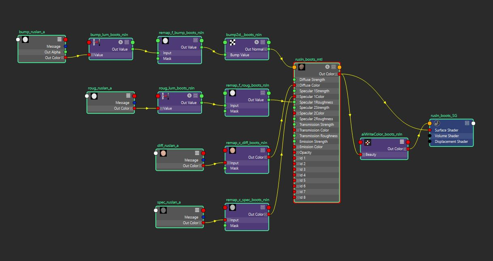
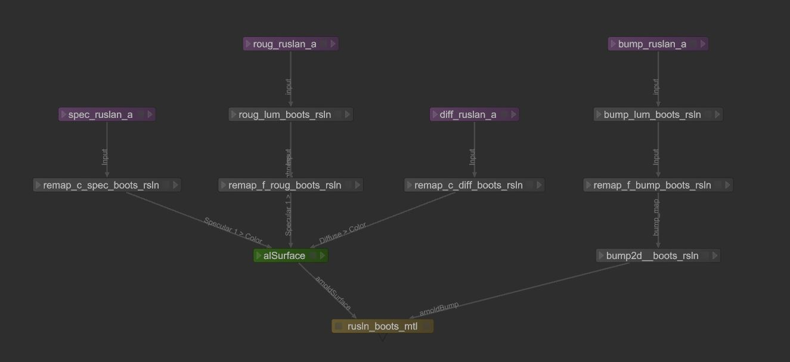

# maya2katana

Easily copy shading nodes from [Maya](http://www.autodesk.com/products/maya/overview) to [Katana](https://www.foundry.com/products/katana)

### Currently supported renderers:

- #### [Arnold 4](https://www.solidangle.com/arnold/) with [alShaders](http://www.anderslanglands.com/alshaders/index.html)
  Supported nodes: aiAmbientOcclusion, aiImage, aiNoise, aiStandard, aiUserDataColor,
  aiUserDataFloat, aiVolumeCollector, alCellNoise, alCombineColor, alCombineFloat, alCurvature,
  alFlake, alFlowNoise, alFractal, alHair, alInputScalar, alInputVector, alJitterColor, alLayer,
  alLayerColor, alLayerFloat, alRemapColor, alRemapFloat, alSurface, alSwitchColor, alSwitchFloat,
  alTriplanar, blendColors, bump2d, clamp, luminance, ramp, samplerInfo

- #### [RenderMan 21.7+](https://renderman.pixar.com/)
  Supported nodes: aaOceanPrmanShader, PxrAdjustNormal, PxrAovLight, PxrAttribute,
  PxrBackgroundDisplayFilter, PxrBackgroundSampleFilter, PxrBakePointCloud, PxrBakeTexture,
  PxrBarnLightFilter, PxrBlack, PxrBlackBody, PxrBlend, PxrBlockerLightFilter, PxrBump,
  PxrBumpManifold2D, PxrCamera, PxrChecker, PxrClamp, PxrColorCorrect, PxrCombinerLightFilter,
  PxrConstant, PxrCookieLightFilter, PxrCopyAOVDisplayFilter, PxrCopyAOVSampleFilter, PxrCross,
  PxrCryptomatte, PxrDebugShadingContext, PxrDefault, PxrDiffuse, PxrDirectLighting, PxrDirt,
  PxrDiskLight, PxrDisney, PxrDisplace, PxrDispScalarLayer, PxrDispTransform, PxrDispVectorLayer,
  PxrDisplayFilterCombiner, PxrDistantLight, PxrDomeLight, PxrDot, PxrEdgeDetect, PxrEnvDayLight,
  PxrExposure, PxrFacingRatio, PxrFilmicTonemapperDisplayFilter, PxrFilmicTonemapperSampleFilter,
  PxrFlakes, PxrFractal, PxrFractalize, PxrGamma, PxrGeometricAOVs, PxrGlass, PxrGoboLightFilter,
  PxrGradeDisplayFilter, PxrGradeSampleFilter, PxrHSL, PxrHair, PxrHairColor,
  PxrHalfBufferErrorFilter, PxrImageDisplayFilter, PxrImagePlaneFilter, PxrIntMultLightFilter,
  PxrInvert, PxrLMDiffuse, PxrLMGlass, PxrLMLayer, PxrLMMetal, PxrLMMixer, PxrLMPlastic,
  PxrLMSubsurface, PxrLayer, PxrLayerMixer, PxrLayerSurface, PxrLayeredBlend, PxrLayeredTexture,
  PxrLightEmission, PxrLightProbe, PxrLightSaturation, PxrManifold2D, PxrManifold3D,
  PxrManifold3DN, PxrMarschnerHair, PxrMatteID, PxrMeshLight, PxrMix, PxrMultiTexture,
  PxrNormalMap, PxrOcclusion, PxrPathTracer, PxrPortalLight, PxrPrimvar, PxrProjectionLayer,
  PxrProjectionStack, PxrProjector, PxrPtexture, PxrRamp, PxrRampLightFilter,
  PxrRandomTextureManifold, PxrRectLight, PxrRemap, PxrRodLightFilter, PxrRollingShutter,
  PxrRoundCube, PxrSeExpr, PxrShadedSide, PxrShadowDisplayFilter, PxrShadowFilter, PxrSkin,
  PxrSphereLight, PxrSurface, PxrTangentField, PxrTee, PxrTexture, PxrThinFilm, PxrThreshold,
  PxrTileManifold, PxrToFloat, PxrToFloat3, PxrVariable, PxrVary, PxrVolume, PxrVoronoise,
  PxrWhitePointDisplayFilter, PxrWhitePointSampleFilter, PxrWorley

### Installation

1. Quit Maya

2. Clone maya2katana repository (or download zip, extract and rename directory from "maya2katana-master" to "maya2katana") and place it to:
```
Windows: \Users\<username>\Documents\maya\scripts
Linux: ~/maya/scripts
```

3. Open Script Editor and paste the following code to Python tab:
```python
import maya2katana
reload (maya2katana)
maya2katana.copy()
```

4. To create a shelf button select the code and middle-mouse-drag it to your shelf

### Usage

1. Select a shading network or a single shadingEngine (Shading Group) node


2. Press the button you've created earlier or execute a script (see installation step)

3. Switch to Katana and paste the nodes


### Integrations

To get the XML from shading network name:
```python
import maya2katana
reload (maya2katana)
node_name = 'materialSG'
# Get the xml as string
resulting_xml = maya2katana.generate_xml(node_name)
```

You can save the resulting XML to file and bring it into Katana:

```python
# Now create the Katana shading network
# Suppose the XML (string) is already loaded
# to 'resulting_xml' string variable
from Katana import NodegraphAPI, KatanaFile
# Create a group for shading network
group_node = NodegraphAPI.CreateNode(node_name, NodegraphAPI.GetRootNode())
# Bring the nodes to Katana scene
# and place them inside the newly created group
nodes = KatanaFile.Paste(resulting_xml, group_node)
```
